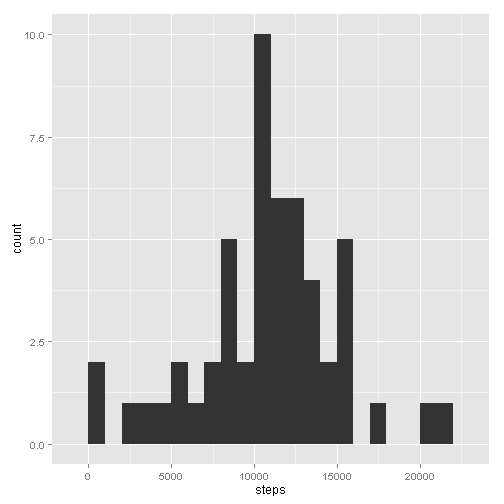
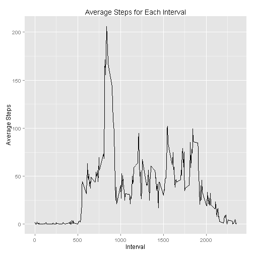
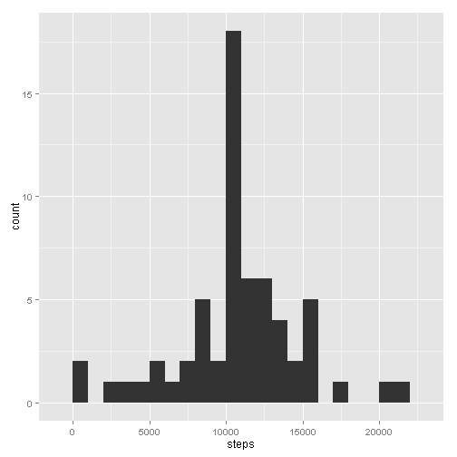
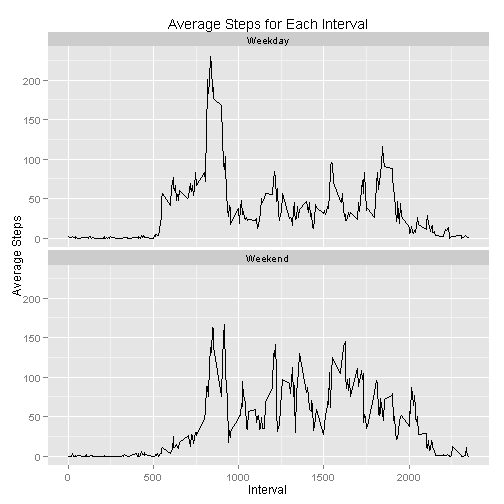

Reproducible Research - Peer Assessment 1
========================================================

This document processes and summarizes the dataset 'Activity monitoring data'. The dataset contains the number of **steps** taken in a 5-minute interval, the **date** the activity measurement was recorded, and an identifier for the 5-minute **interval** in which the measurement was recorded. 


```r
opts_chunk$set(echo = TRUE, results = "asis")
library(ggplot2)
```

**Read the dataset**

```r
df <- read.csv("activity.csv",as.is=T)
df$date <- as.Date(df$date)
```

**Summarize the total number of steps for each day and show histogram (ignore NAs).**

```r
sry1 <- aggregate(df$steps,list(df$date),sum)
names(sry1) <- c("date","steps")

sry1 <- na.omit(sry1)
g <- ggplot(sry1,aes(date,steps)) + labs(title="Number of Steps Per Day(ignore NAs)") 
g <- g + geom_histogram(stat="identity") + labs(x="Date") + labs(y="Steps")
print(g)
```

 

**Show mean and median:**

```r
sry1mean <- as.integer(round(mean(sry1$steps,na.rm=T)))
sry1median <- median(sry1$steps,na.rm=T)
```
**The mean of number of steps per day is 10766, and the median of number of steps is 10765.**


**Calculate average number of steps for each interval across all days and show a line graph:**

```r
sry2 <- aggregate(df$steps[!is.na(df$steps)],list(df$interval[!is.na(df$steps)]),FUN=mean)
names(sry2) <- c("interval","avg_steps")

g <- ggplot(sry2,aes(interval,avg_steps)) + geom_line()
g <- g + labs(title="Average Steps for Each Interval")
g <- g + labs(x="Interval") + labs(y="Average Steps")
print(g)
```

 

```r
sry2mx <- sry2[sry2$avg_steps == max(sry2$avg_steps),]
```
**The maximum average number of steps is 206 for the interval 835.**


```r
nnas <- nrow(df[is.na(df),])
```
**The number of missing values in the dataset are 2304.**


**A sensible and simple approach to filling in the missing values is to replace them with the average of number of steps for the 5-minute intervals taken over all days. The following code fills in the missing values using such an approach.**

```r
df2 <- df
for (i in which(is.na(df))) {
       df2$steps[i] <- sry2$avg_steps[which(sry2$interval == df2$interval[i])] 
}
```


**Summarize the number of steps for each day, with missing values filled in, and show a histogram.**

```r
sry3 <- aggregate(df2$steps,list(df2$date),sum)
names(sry3) <- c("date","steps")

g <- ggplot(sry3,aes(date,steps)) + labs(title="Number of Steps Per Day(filled NAs)")
g <- g + geom_histogram(stat="identity") + labs(x="Date") + labs(y="Steps")
print(g)
```

 


```r
sry3mean <- as.integer(round(mean(sry3$steps)))
sry3median <- as.integer(round(median(sry3$steps)))
```
**After flling in missing values, the mean of number of steps per day is 10766, and the median of number of steps is 10766.**


Evidently, the substitution of missing values did not change the average daily mean and median by much. The reason for this is that the replacement values were themselves mean of the steps over 5-minute intervals across all days.


**Factorize the dataset into weekdays and weekends.**

```r
df2$wday <- gsub("(Mon|Tues|Wednes|Thurs|Fri)day","Weekday",
                 gsub("(Satur|Sun)day","Weekend",weekdays(df2$date)))
df2$wday <- factor(df2$wday)
```


**Summarize the number of steps for each 5-minute interval over weekdays and weekends and plot a graph.**

```r
sry4 <- aggregate(df2$steps,list(df2$wday,df2$interval),mean)
names(sry4) <- c("wday","interval","avg_steps")

g <- ggplot(sry4,aes(interval,avg_steps)) + geom_line()
g <- g + stat_bin() + facet_wrap(~wday,ncol=1)
g <- g + labs(title="Average Steps for Each Interval")
g <- g + labs(x = "Interval") + labs(y = "Average Steps")
print(g)
```

 
